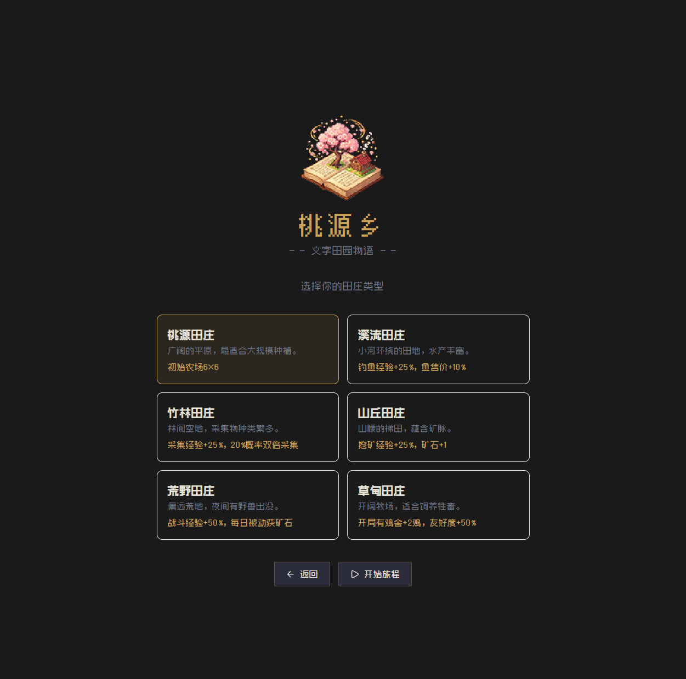
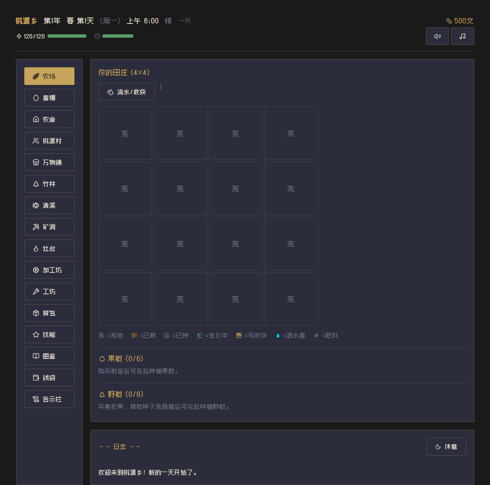

<div align="center">
  
</div>

# 桃源乡

> 传说在群山深处，有一处与世隔绝的村落——桃源乡。
> 这里四季分明，民风淳朴，但近年来年轻人纷纷离去，村庄日渐冷清。
> 你收到一封来自已故祖父的信，信中附有一把铜钥匙和一张泛黄的地契……

一款文字版田园模拟经营游戏，灵感来自星露谷物语，采用像素 + 中国风视觉设计。纯客户端运行，无需后端服务器。

## 游戏特色

**角色创建** — 输入名字、选择性别，6 种田庄各有独特加成（溪流钓鱼加成、竹林采集加成、山丘挖矿加成等），NPC 根据性别使用不同称呼

**四季轮回** — 春耕夏种秋收冬藏，28 天一季，昼夜时段变化（6:00-次日2:00），六种天气（晴/雨/雷雨/雪/大风/绿雨）

**田庄经营** — 38 种作物四季轮作，4×4 起步扩建至 8×8；3 种洒水器自动浇水，6 种肥料提升品质；建造温室全季种植，8 种果树 28 天挂果

**畜牧养殖** — 鸡舍（鸡/鸭/兔/鹅/鹌鹑/鸽/乌骨鸡/孔雀）+ 畜棚（牛/羊/山羊/水牛/牦牛/羊驼/鹿/鸵鸟/骆驼/驼鹿/驴），共 19 种动物，畜舍 3 级升级

**技能成长** — 农耕、采集、钓鱼、挖矿四大技能，等级 5 和 10 可选择专精方向

**乡里社交** — 34 位村民（12 位可婚 NPC），送礼、聊天、触发心事件，求婚成家、配偶助农；6 位隐藏仙灵 NPC（龙灵、桃夭、月兔、狐仙、山翁、归女），独立发现链 + 缘分系统 + 结缘奖励

**钓鱼系统** — 6 大钓点（溪流/池塘/江河/暗河/瀑布/沼泽），60 种鱼类；实时小游戏：长按拉线控制钩子高度，进度达标即收杆；鱼饵、浮漂、蟹笼、雨天淘金

**鱼塘养殖** — 建造鱼塘投放鱼苗，每日产出副产品，繁殖增殖

**矿洞探险** — 云隐矿洞 120 层（浅层/冰霜/熔岩/水晶/暗影/深渊），每 20 层 BOSS 战，回合制战斗；通关后解锁骷髅矿穴

**翰海沙漠** — 矿洞之外的高级冒险区域，更稀有的资源与更强的敌人

**烹饪系统** — 113 种食谱，烹饪料理恢复体力、生命值并获得当日增益

**加工制造** — 21 种加工机器（酒坊/酱缸/油坊/熔炉/织布机/制茶机/药碾等），150+ 种加工配方

**仓库箱子** — 5 种材质箱子（木/铜/铁/金/虚空），分类存放物品；虚空箱支持远程存取，可指定为原料箱/成品箱实现作坊自动出入料

**育种系统** — 种子制造机产出育种种子，杂交培育新品种，400 种杂交配方横跨 10 代谱系

**冒险公会** — 21 种讨伐目标，击杀怪物积累声望解锁奖励

**博物馆收集** — 捐赠矿物、文物与仙灵物品，集齐解锁奖励

**装备系统** — 武器、帽子、鞋子、戒指，套装效果加成

**任务成就** — 5 章 50 个主线剧情任务、每日委托（送货/钓鱼/采矿/采集）、20 个社区任务包；109 个成就贯穿全部玩法

**程序化音乐** — Tone.js 实时合成，中国风五声音阶（宫商角徵羽）；19 首 BGM（四季+节日+小游戏+战斗+翰海），80+ 种音效；天气与时段动态修饰音色和节奏

## 游戏截图





## 快速开始

```bash
# 安装依赖
pnpm install

# 启动开发服务器
pnpm dev

# 类型检查 + 生产构建
pnpm build

# 预览构建结果
pnpm preview

# 构建 Electron 桌面客户端
pnpm build:electron
```

## 技术栈

| 技术            | 版本  | 用途                            |
| --------------- | ----- | ------------------------------- |
| Vue 3           | 3.5   | 组合式 API + `<script setup>`   |
| TypeScript      | 5.9   | 严格类型检查                    |
| Vite            | 7     | 构建与开发服务器                |
| Pinia           | 3     | 状态管理（26 个 store）         |
| TailwindCSS     | 3     | 原子化样式 + CSS 变量自定义主题 |
| Vue Router      | 5     | 客户端路由（23 个游戏面板）     |
| Tone.js         | 15    | 程序化音频合成（BGM + SFX）     |
| Electron        | 39    | 桌面客户端打包                  |
| lucide-vue-next | 0.563 | 图标库                          |
| VueUse          | 14    | 组合式工具函数                  |
| CryptoJS        | 4     | 存档 AES 加密                   |

## 项目结构

```
src/
├── views/              # 页面级组件
│   ├── MainMenu.vue    # 主菜单（新游戏、存档管理、导入导出）
│   ├── GameLayout.vue  # 游戏主布局（状态栏 + 侧栏 + 日志 + 弹窗）
│   └── game/           # 23 个游戏面板
│       ├── FarmView.vue        # 农场
│       ├── AnimalView.vue      # 畜牧
│       ├── HomeView.vue        # 家园与仓库
│       ├── ShopView.vue        # 商店
│       ├── NpcView.vue         # 村民社交
│       ├── FishingView.vue     # 钓鱼
│       ├── FishPondView.vue    # 鱼塘
│       ├── MiningView.vue      # 矿洞
│       ├── HanhaiView.vue      # 翰海沙漠
│       ├── CookingView.vue     # 烹饪
│       ├── ProcessingView.vue  # 作坊加工
│       ├── BreedingView.vue    # 育种
│       ├── MuseumView.vue      # 博物馆
│       ├── GuildView.vue       # 冒险公会
│       ├── InventoryView.vue   # 背包
│       └── ...                 # 更多面板
├── components/game/    # 20 个子组件（小游戏、对话框、状态栏等）
├── stores/             # 26 个 Pinia 状态仓库
├── composables/        # 可复用逻辑（导航、日结算、日志、音频、对话等）
├── data/               # 40 个游戏数据模块（作物、物品、NPC、鱼类、食谱等）
├── types/              # TypeScript 类型定义
├── router/             # Vue Router 路由配置
├── assets/             # 静态资源（zpix 像素字体、Logo）
├── app.css             # 全局样式与 Tailwind 主题
├── App.vue             # 根组件
└── main.ts             # 应用入口
```

## 游戏系统一览

| 系统     | 说明                                                                               |
| -------- | ---------------------------------------------------------------------------------- |
| 时间     | 年 → 季（春夏秋冬）→ 天（28天/季）→ 时段（6:00-次日2:00），六种天气                |
| 体力     | 初始 120，所有操作消耗体力，可通过药膳提升上限至 180                               |
| 农场     | 38 种作物，4×4→8×8 地块，3 种洒水器 + 6 种肥料，温室全季种植                       |
| 畜牧     | 19 种动物（鸡舍 8 种 + 畜棚 11 种），畜舍 3 级升级                                 |
| 鱼塘     | 投放鱼苗养殖，每日产出副产品，可繁殖增殖                                           |
| 育种     | 种子制造机产出育种种子，培育高品质作物品种，400 种杂交配方横跨 10 代               |
| 品质     | 普通/优良/精品/极品，影响售价（×1.0/×1.25/×1.5/×2.0）和送礼效果                    |
| 背包     | 20-36 格，单格堆叠上限 99，工具栏独立                                              |
| 仓库     | 分类箱子系统（木/铜/铁/金/虚空），虚空箱支持远程存取与作坊自动出入料               |
| 工具     | 水壶/锄头/镐/鱼竿，三级升级（基础→铁制→精钢），降低体力消耗                        |
| 装备     | 武器、帽子、鞋子、戒指，套装效果加成                                               |
| 商店     | 按季节更新商品，可出售背包物品，物品品质可视化标识                                 |
| NPC      | 34 位村民（12 位可婚）+ 6 位隐藏仙灵，好感度/缘分、心事件、节日活动，配偶/仙缘助农 |
| 矿洞     | 云隐矿洞 120 层（6 区）+ 骷髅矿穴 + 翰海沙漠，回合制战斗，每 20 层 BOSS            |
| 公会     | 21 种讨伐目标，击杀积累声望解锁奖励                                                |
| 博物馆   | 捐赠矿物、文物与仙灵物品（40 件），集齐解锁奖励                                    |
| 任务     | 5 章 50 个主线任务 + 每日委托 + 20 个社区任务包，109 个成就                        |
| 存档     | 3 个存档槽位（localStorage + AES 加密），每日自动保存，支持导入导出、WebDAV 云同步 |
| 音乐音效 | Tone.js 程序化合成，五声音阶 19 首 BGM + 80 余种音效，天气/时段动态修饰            |

## 设计规范

- **配色**：传统中国色系（墨色背景 #1a1a1a、赤金强调 #c8a45c、朱红警告 #c34043、竹青成功 #5a9e6f）
- **字体**：zpix 像素字体，关闭字体平滑
- **UI 风格**：扁平硬边按钮、1px 细边框、最大 2px 圆角、4px 倍数间距
- **响应式**：移动端底部导航 + 桌面端侧边栏，768px 断点

## 交流

- QQ 群：920930589
- GitHub：[https://github.com/setube/taoyuan](https://github.com/setube/taoyuan)

## 许可证

本项目采用 [CC BY-NC 4.0](https://creativecommons.org/licenses/by-nc/4.0/deed.zh-hans) 许可协议。

允许自由共享和演绎，但 **未经作者书面授权，禁止用于任何商业目的**。详见 [LICENSE](LICENSE) 文件。
